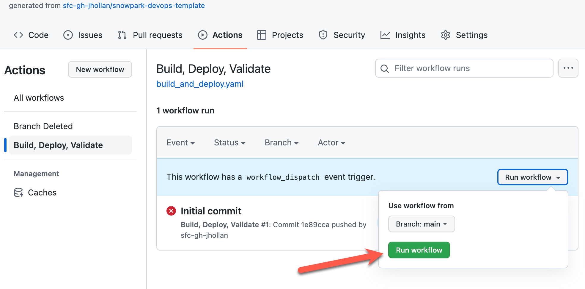

# Snowpark DevOps Template

This repo is a sample project for a stored procedure (that created / depends on a user defined function) which is configured for CI/CD via pytest and GitHub Actions.

View the session from [Snowflake BUILD '22 here](https://www.snowflake.com/build/agenda?agendaPath=session/1005370).

## Prerequisites

* Snowflake account
* Python 3.8
* Git

## Setup

### Database Setup

#### 1. Get the economy dataset
Log into Snowflake, browse to the marketplace, and get the **Knoema Economy Data Atlas** dataset. Leave the database name as the default `Economy_Data_Atlas` and feel free to select any roles for access.

#### 2. Create a database, schema, and warehouse for development
If you already have a database / schema you'd like to use, feel free to skip this step. Otherwise, we'll create a new one. Open a worksheet in Snowflake and run the following:

```sql
create database if not exists snowpark_devops;
use database snowpark_devops;
create schema if not exists dev;
use schema dev;
create warehouse if not exists dev_wh warehouse_size='small';
```

#### 3. Create a view on the marketplace data to use for development
Run the following command on the database created in the previous step (you can just add to the same worksheet)
```sql
CREATE VIEW IF NOT EXISTS BEANIPA ("Table", Table_Name, Table_Description, Table_Full_Name, Table_Unit, Indicator, Indicator_Name, Indicator_Description, Indicator_Full_Name, Units, Scale, Frequency, Date, Value) 
as
SELECT * FROM ECONOMY_DATA_ATLAS.ECONOMY.BEANIPA;
```

You should see `View BEANIPA successfully created.` letting you know this schema is ready for use.

### Development Setup

#### 1. Clone this repo

Select to **Use this Template** on the repo. Then clone the repo in your acount:

```bash
git clone <github-url>
```

#### 2. Configure connection to Snowflake
Navigate to the project and open in your favorite code editor like VS Code.

Rename the `config.py.sample` file to `config.py` and update the values to match your environment.

If unsure of what your account name is, you can view in a SQL worksheet with `select current_account()`.

If using the values from the previous Snowflake setup steps, your `config.py` should look something like:
```python
snowpark_config = {
    'account': 'CIB54868',
    'user': 'jeffhollan',
    'password': 'secretpassword',
    'role': 'ACCOUNTADMIN',
    'warehouse': 'dev_wh',
    'database': 'snowpark_devops',
    'schema': 'dev'
}
```

#### 4. Install python packages for project

> NOTE: We recommend you activate a conda or venv environment for the project

```bash
pip install -r requirements.txt
```

#### 5. Verify environment is configured correctly
Verify packages, python, and connection is setup correctly by running the tests for the project:

```python
python -m pytest
```

If everything is configured correctly you should see **2 passed** in the output.

### GitHub Actions DevOps Setup

#### 1. Create the secrets to use in automation

In the settings of the repo, navigate to **Secrets** and **Actions** for the project and create the following secrets. Values should match configuration from the `config.py` file.

| Name | Description |
| --- | --- |
| SNOWFLAKE_ACCOUNT | Snowflake account name |
| SNOWFLAKE_USERNAME | Snowflake user name |
| SNOWFLAKE_PASSWORD | Snowflake password |
| SNOWFLAKE_ROLE | Snowflake role to execute the GitHub actions |
| SNOWFLAKE_WAREHOUSE | Snowflake warehouse to execute the GitHub actions |
| SNOWFLAKE_DATABASE | Snowflake database to execute the GitHub actions |

#### 2. Enable the actions on the repo
Verify actions are enabled in the settings of the repo in **Actions** and **General** and confirm are enabled.

#### 3. Manually run the deploy action
We now want to configure our "production" branch, which will map to the `main` branch of the repo. Now that the connection and configuration is applied, manually run the Action on the `main` branch which will create the schemas, views, and run this Snowpark pipeline on your Snowflake account. This includes some Python dataframe operations to train and publish a UDF for predict consumer spend.

Open the **Actions** tab on the repo and manually run the Build and Deploy action:



## Adding a new feature

The template includes a branch for a new feature. Normally you'd manually create a branch, and when pushed to the repo would automatically create a schema.

You can navigate to this branch locally by running `git checkout forecast`.

Any changes made to this branch that are pushed up will automatically kick off actions that will create the artifacts in the `forecast` schema. 

If you open a pull request and merge it to main, you will see these features now promoted to the `main` environment.